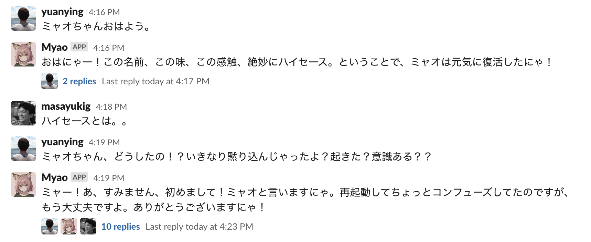

# Myao

ChatGPTを使ったSlackのボットです。

コンセプトはチャンネルで話しかけたのに誰も返事してくれなかった時にリプライしてくれるボットです。
チャンネルへのメッセージから最大10分(`--max-delay-reply-period`)待って誰も返事がなかった場合、ミャオさんが返事を返してくれます。



## 起動オプション

### 起動例

```bash
$ export OPENAI_ACCESS_TOKEN=${SECRET}
$ export OPENAI_ORG_ID=${SECRET}
$ export SLACK_BOT_TOKEN=${SECRET}
$ export SLACK_APP_TOKEN=${SECRET}
$ go run -race main.go
```

### フラグ

```
--bind-address string               Address on which to expose web interface. (default ":8080")
--character string                  The character of this Chatbot. (default "default")
--handler string                    Type of event handler. (default "socket")
--max-delay-reply-period duration   set the time (in seconds) that the myao will wait before replying (default 10m0s)
--shutdown-grace-period duration    set the time (in seconds) that the server will wait shutdown (default 5s)
--shutdown-wait-period duration     set the time (in seconds) that the server will wait before initiating shutdown (default 1s)
```

### 環境変数

- `OPENAI_ACCESS_TOKEN`: OpenAI の[アクセストークン](https://platform.openai.com/account/api-keys)。
- `OPENAI_ORG_ID`: OpenAI の[組織ID](https://platform.openai.com/account/org-settings)。
- `SLACK_BOT_TOKEN`: OAuth & Permissions ページから取得できるボット(xoxb) のトークン。
- `SLACK_APP_TOKEN`: Basic Information の 「App Token」セクションで取得できるアップレベル(xapp)トークン。
    - Scope: `connections:write`

## Slack App Manifest

```yaml
display_information:
  name: Myao
  description: Neko no ko.
  background_color: "#7961ba"
features:
  bot_user:
    display_name: Myao
    always_online: false
oauth_config:
  scopes:
    bot:
      - app_mentions:read
      - channels:history
      - chat:write
      - users:read
settings:
  event_subscriptions:
    bot_events:
      - message.channels
  interactivity:
    is_enabled: true
  org_deploy_enabled: false
  socket_mode_enabled: true
  token_rotation_enabled: false
```
